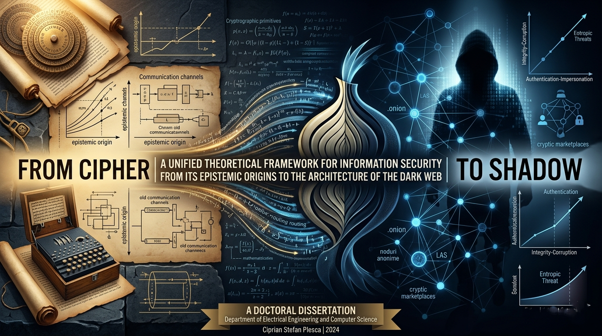

# Entropic Threat Continuum

**A unified theoretical and computational framework for information security, adversarial uncertainty, anonymity networks, and attack-surface quantification.**

Author: **Ciprian Stefan Plesca**  
Primary source: *From Cipher to Shadow: A Unified Theoretical Framework for Information Security from Its Epistemic Origins to the Architecture of the Dark Web* (Doctoral Dissertation, 2024)  
License: **MIT**

[](./LICENSE)
[](./pyproject.toml)
[](./tests)



## Purpose

This repository turns the dissertation's theoretical work into a complete, inspectable, reusable research package. It contains formal definitions, simulation code, a machine-readable taxonomy, reproducibility scripts, assets, tests, notebooks, and citation metadata.

The central contribution is the **Entropic Threat Continuum (ETC)**, a model of information security as a dynamic adversarial continuum governed by three invariant axes:

| Axis | Symbol | Question answered |
|---|---:|---|
| Confidentiality-Exposure Axis | CEA | Can protected information be exposed? |
| Authentication-Impersonation Axis | AIA | Can identity or authority be forged? |
| Integrity-Corruption Axis | ICA | Can information or system state be corrupted? |

## Original Constructs

- **Entropic Threat Continuum (ETC)**: five-tuple model `(S, A, T, D, E)` for security states, adversarial actions, transitions, measurements, and effort.
- **Adversarial Entropy Gradient (AEG)**: quantifies how adversarial effort reduces uncertainty.
- **Trust Decay Function (TDF)**: models credential trust degradation through time and breach events.
- **Dark Topology Conjecture (DTC)**: relates network algebraic connectivity to anonymity-set behavior.
- **Layered Anonymity Stack (LAS)**: six-layer model for anonymous overlay networks.
- **Threat Surface Integral (TSI)**: integrates vulnerability, probability, and impact across attack vectors.
- **Contextual Exposure Principle (CEP)** and **Opacity Migration Theorem (OMT)**: formal principles for relational exposure and vulnerability migration.
- **Plesca Taxonomy**: ETC-axis attack classification with 847 declared primitive types.

## Repository Map

```text
.
|-- README.md
|-- LICENSE
|-- CITATION.cff
|-- CHANGELOG.md
|-- pyproject.toml
|-- dissertation/
|-- docs/
|   |-- FRAMEWORK_OVERVIEW.md
|   |-- FORMAL_DEFINITIONS.md
|   |-- TAXONOMY_REFERENCE.md
|   |-- GLOSSARY.md
|   |-- API_REFERENCE.md
|   |-- ERRATA.md
|   `-- ROADMAP.md
|-- src/
|   |-- simulation/
|   |   |-- etc_framework.py
|   |   |-- aeg_model.py
|   |   |-- tdf_model.py
|   |   |-- tsi_calculator.py
|   |   |-- las_analyzer.py
|   |   |-- dtc_simulation.py
|   |   `-- utils.py
|   `-- taxonomy/
|       |-- plesca_taxonomy.json
|       `-- taxonomy_validator.py
|-- assets/
|   |-- figures/
|   |-- diagrams/
|   `-- data/
|-- notebooks/
|-- scripts/
|-- tests/
`-- citation/
```

## Quickstart

```bash
python -m venv .venv
source .venv/bin/activate
pip install -e ".[dev]"
pytest
```

On Windows PowerShell:

```powershell
py -m venv .venv
.\.venv\Scripts\Activate.ps1
pip install -e ".[dev]"
pytest
```

## Examples

Run a compact Dark Topology Conjecture simulation:

```bash
python -m simulation.dtc_simulation --n 60 --configs 5 --runs 5 --alpha 0.20
```

Validate the taxonomy:

```bash
python scripts/validate_taxonomy.py
```

Generate reproducibility figures and sample CSV outputs:

```bash
python scripts/generate_figures.py
```

Use the core framework from Python:

```python
from simulation import SecurityState, etc_security_functional

state = SecurityState(cea=0.82, aia=0.74, ica=0.91)
print(etc_security_functional(state))
```

## Academic Scope and Ethics

This repository is intended for research, education, defensive security modeling, privacy engineering, and reproducible academic discussion. It does not provide operational instructions for unauthorized access, exploitation, or abuse. The models are abstractions and should not be treated as substitutes for professional security assessment.

## Citation

If this repository or the dissertation's theoretical constructs are useful in academic work, cite:

```text
Plesca, C. S. (2024). From cipher to shadow: A unified theoretical framework
for information security from its epistemic origins to the architecture of the
Dark Web [Doctoral dissertation].
```

Machine-readable citation metadata is available in [`CITATION.cff`](./CITATION.cff), and BibTeX is available in [`citation/bibtex.bib`](./citation/bibtex.bib).

## Support This Research

This work represents years of independent research in information security theory, privacy engineering, anonymity networks, and post-quantum cryptographic transitions. Donations help sustain future publications, simulation infrastructure, open-access dissemination, and academic conference or peer-review costs.

Donation channels:

| Channel | Link / Address |
|---|---|
| PayPal | [paypal.me/agentflowenterprise](https://paypal.me/agentflowenterprise) |
| GitHub Sponsors | [github.com/sponsors/Ciprian-LocalPulse](https://github.com/sponsors/Ciprian-LocalPulse) |
| Bitcoin (BTC) | `bc1qf3yy0w8z37rwavxpu38wem3yffpanw7wzj32qj` |
| Ethereum (ETH) | `0x27d9a6a5b8507e6031bb044319410da96222d402` |
| Bank transfer | Open a GitHub issue tagged `[donation-inquiry]` |

EUR transfer

European payments
Recipient
Ciprian Stefan Plesca
IBAN
BE83 9679 1975 8915
SWIFT / BIC
TRWIBEB1XXX
Bank address
Wise, Rue du Trône 100, 3rd floor, Brussels, 1050, Belgium

GBP transfer

United Kingdom payments
Recipient
Ciprian Stefan Plesca
Account number
92055372
Sort code
23-14-70
IBAN
GB68 TRWI 2314 7092 0553 72
SWIFT / BIC
TRWIGB2LXXX
Bank address
Wise Payments Limited, 1st Floor, Worship Square, 65 Clifton Street, London, EC2A 4JE, United Kingdom

USD transfer

United States payments
Recipient
Ciprian Stefan Plesca
Account type
Checking
Routing number
026073150
Account number
8314225367
SWIFT / BIC
CMFGUS33
Bank address
Community Federal Savings Bank, 89-16 Jamaica Ave, Woodhaven, NY, 11421, United States

100% of donations received through this repository are allocated to research continuation, open-access dissemination, simulation infrastructure, and academic review or conference activity. See [`DONATE.md`](./DONATE.md) for the full donation policy, institutional support options, and acknowledgement preferences.

## License

This repository is released under the MIT License. See [`LICENSE`](./LICENSE).
