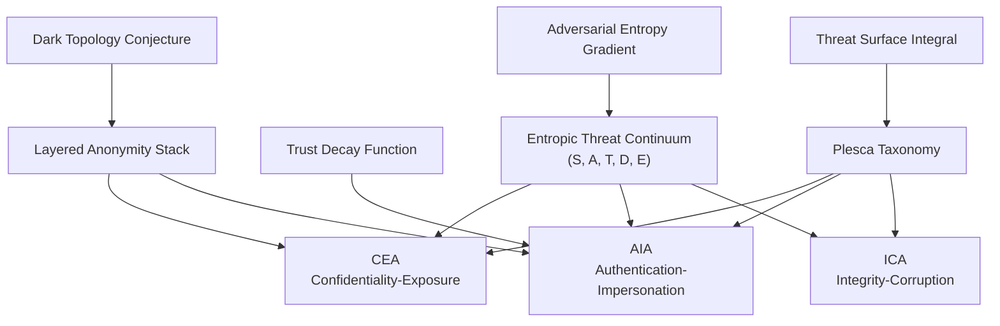

# ETC Framework - Relationships Between Constructs

The constructs are deliberately coupled: ETC supplies the coordinate system, the taxonomy supplies the vector catalogue, and AEG/TDF/TSI/LAS/DTC provide specialized analytic lenses.
